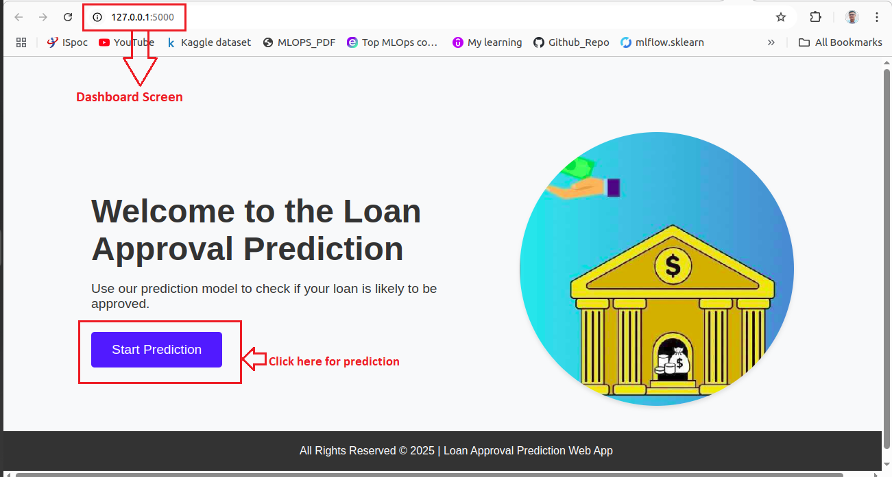

# Bank Loan Approval Predictor App


---
## 📌 Problem Statement:
Predict whether a loan applicant will get loan approval (Yes or No) based on various financial and personal details such as income, credit history, employment status, etc.

---
## 🚀 Approach:
To solve this problem, I used the **Random Forest Classifier** algorithm. For a detailed analysis and intuition behind using this algorithm, please watch the video that explains the problem statement and the rationale for selecting this algorithm.

### 🎥 Video 1: Describes the Problem Statement and Algorithm  
[Watch Video 1](https://www.loom.com/share/eb1b90fd450a492bac0f5e7929df10c4?sid=2bf2c5df-287b-48d4-b8db-5b3f58eac22d)

### 🎥 Video 2: Covers All Components of the Training Pipeline  
[Watch Video 2](https://www.loom.com/share/da89519206d34bb6abe9d28e86b16622?sid=28869b58-7235-4627-b2d0-87203af78058)

---
## 📝 Dataset Details:
The dataset contains information like:

- Loan_ID – Unique identifier for the loan
- Gender – Male/Female
- Married – Whether the applicant is married
- Dependents – Number of dependents
- Education – Graduate/Not Graduate
- Self_Employed – Whether the applicant is self-employed
- ApplicantIncome – Monthly income of the applicant
- CoapplicantIncome – Monthly income of co-applicant
- LoanAmount – Loan amount applied for
- Loan_Amount_Term – Term of the loan in months
- Credit_History – Whether the applicant has a history of repaying loans
- Property_Area – Urban/Rural/Semi-Urban
- Loan_Status – Target Variable (Y/N) (Loan Approved or Not)


## 🛠️ ML Tools & Technologies Used for This Project:

### 🐳 Docker
- **Used to create containers and push them to DockerHub.** Docker allows you to package your application and its dependencies into a container, ensuring consistency across different environments.

### 🗂️ DVC (Data Version Control)
- **Used for versioning datasets and models.** DVC helps manage large files, track changes, and facilitate collaboration between teams when working with data and machine learning models.

> ⚡ **Note:** To track the dataset with DVC and push it to Dagshub, follow these steps:
> 
> 1. Initialize DVC in your project directory:
>    ```bash
>    dvc init
>    ```
> 
> 2. Add your dataset to DVC (replace `data\1\Loan_data_set.csv` with the address of your dataset):
>    ```bash
>    dvc add data\1\Loan_data_set.csv
>    ```
> 
> 3. Commit the changes to Git (the DVC metadata will be saved in Git):
>    ```bash
>    git add . 
>    git commit -m "Add dataset to DVC"
>    ```
> 
> 4. Create a repository on Dagshub (replace `<YOUR_DAGSHUB_REPO_URL>` with your own repository URL).
> 
> 5. Connect your DVC project to the Dagshub remote:
>    ```bash
>    dvc remote add -d dagshub <YOUR_DAGSHUB_REPO_URL>
>    ```
>    Replace `<YOUR_DAGSHUB_REPO_URL>` with the URL of your Dagshub repository (e.g., `https://dagshub.com/your_username/your_repo.dvc`).
> 
> 6. Push your dataset to Dagshub:
>    ```bash
>    dvc push
>    ```
> 
> This will upload your dataset to Dagshub while keeping your project files in GitHub for version control. Dagshub will manage the dataset versioning and tracking.


### 📊 MLflow
- **Used for managing the machine learning lifecycle.** MLflow is used for tracking experiments, packaging code into reproducible runs, and managing model deployment.

> ⚡ **Note:** If you want to access the MLflow dashboard, run `mlflow ui` in the terminal, and the dashboard will appear at [http://127.0.0.1:5000/](http://127.0.0.1:5000/). In case of any failure, add the following line to `model_evaluation.py`:
> mlflow.set_tracking_uri("http://127.0.0.1:5000")

### 🌐 Dagshub
- **Used for managing and versioning data science projects.** Dagshub integrates DVC and Git to manage datasets, code, and models, helping teams collaborate efficiently on machine learning projects.

> ⚡ **Note:** To create a repository on Dagshub and use DVC for versioning datasets, follow these steps:
> 
> 1. **Create a new repository on Dagshub:**
>    - Visit [Dagshub](https://dagshub.com) and log in or create an account.
>    - Click on the "Create New Repository" button.
>    - Enter a repository name and description, and choose whether it will be public or private.
>    - Click "Create Repository."
> 
> 2. **Set up DVC with your Dagshub repository:**
>    - Once your repository is created, you'll be provided with a URL for the remote.
>    - In your local project directory, link your DVC project to the Dagshub repository:
>      ```bash
>      dvc remote add -d dagshub <YOUR_DAGSHUB_REPO_URL>
>      ```
>      Replace `<YOUR_DAGSHUB_REPO_URL>` with the URL of your Dagshub repository (e.g., `https://dagshub.com/your_username/your_repo.dvc`).
> 
> 3. **Push the dataset to Dagshub:**
>    - After initializing DVC and adding your dataset (as explained earlier), push your dataset to the Dagshub remote:
>      ```bash
>      dvc push
>      ```
> 
> This setup allows you to manage both your code (via Git) and your datasets (via DVC) in a centralized location on Dagshub, ensuring versioning and easy collaboration.


### 🔄 Luigi
- **Used for building complex pipelines.** Luigi helps automate the execution of workflows, ensuring reproducibility and scalability of tasks such as data preprocessing, model training, and evaluation.

> ⚡ **Note:** If you want to access the Luigi dashboard, set `local_scheduler=False` in the `training_pipeline` and then run `luigid` in the terminal. The dashboard will appear at [http://localhost:8082/](http://localhost:8082/).

### 🌀 Airflow  
- **Used for orchestrating and scheduling workflows.** It supports task dependencies, retries, and parallel execution, making it ideal for automating ETL processes, machine learning workflows, and more.

> 🗒️ **Note:**  
> In this project, we are using **Luigi** for the training pipeline, but an alternative is **Airflow**, which can also be used.  
> To run Airflow, use the following commands in the terminal:
>
> ```bash
> airflow scheduler
> airflow webserver
> ```
<!-- --- -->


## Instructions to Run the Loan Approval Model App
There are two ways to run the loan approval prediction app. Follow one of the methods below:

### 💡 Recommendation:
If your goal is just to get predictions, please use **Method 2 (Docker)** 🐳, which involves using the container and launching it. This method provides a more streamlined and efficient setup.


### 🖥️ Method 1: Git Clone & Run Locally
1. Clone the Git repository:
- First, clone the repository containing the code.
```bash
git clone --branch luigui_mlflow https://git.impressicocrm.com/mlops/dev_mlops.git
```

2. Navigate into the project directory:
```bash
cd dev_mlops/
```
3. Create and activate a virtual environment (optional but recommended):
- If you don't have venv installed, you can install it using the following command:
```bash
python -m pip install --user virtualenv
```
- Create a virtual environment:
```bash
python3 -m venv venv
```
- Activate the virtual environment: On Linux/macOS:
```bash 
source venv/bin/activate
```
- On Windows:
```bash 
.\venv\Scripts\activate
```
4. Install the required dependencies:

- Install the dependencies specified in requirements.txt:
```bash 
pip install -r requirements.txt
```
5. Run the application:

- Start the application using the following command:
```bash 
python app.py
```
- The app will now be running at http://localhost:5000

### 🚀 Method 2: Using Docker
- If you prefer to run the app using Docker, follow these steps:

1. Install Docker if it is not pre-installed:
```bash 
sudo apt update
sudo apt install apt-transport-https ca-certificates curl software-properties-common
curl -fsSL https://download.docker.com/linux/ubuntu/gpg | sudo apt-key add -
sudo add-apt-repository "deb [arch=amd64] https://download.docker.com/linux/ubuntu $(lsb_release -cs) stable"
sudo apt update
sudo apt install docker-ce
```

2. Pull the Docker image:

- After Docker is installed, pull the pre-built image from Docker Hub by running the following command:
```bash
sudo docker pull abhishekanand02/loan_aprroval_model:v1.0
```

3. Run the docker container:
- Once the image is downloaded, run the app in a Docker container:
```bash
sudo docker run -p 5000:5000 abhishekanand02/loan_aprroval_model:v1.0
```
- This will expose the app on port 5000. You can now access it via http://localhost:5000.


4. Finally, Command to stop & Remove the container:
```bash
sudo docker ps -a
sudo docker stop <container-id>
sudo docker rm <container-id>
```


### 🖼️ Visuals:


## 🔮 Future Scope:

While the current model uses the Random Forest Classifier to predict loan approvals, there are several areas where improvements can be made in the future:

1. **Model Enhancement:**
   - Explore other machine learning models such as **Gradient Boosting Machines (GBM)**, **XGBoost**, or **Neural Networks** for potentially better performance.
   - Implement **Hyperparameter Tuning** techniques like **Grid Search** or **Random Search** to optimize model performance.

2. **Data Sources:**
   - Integrate more diverse datasets that include additional features, such as geographic information, social media activity, or transaction history, to provide a more comprehensive model.
   - Incorporate **real-time data** to make the prediction process more dynamic and accurate.

3. **Monitoring:**
   - Use **Model Monitoring** tools to track performance and retrain the model when the data distribution shifts over time (concept drift).


---

## 👨‍💻 Developer:
This project was developed by **Abhishek Anand**.

Feel free to reach out at bgsabhishekanand02@gmail.com if you have any questions or suggestions!


